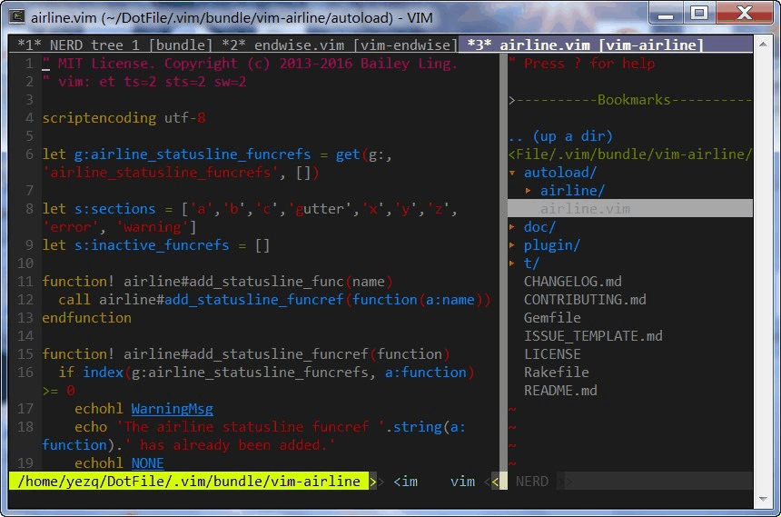

### About
I am an embedded engineer working on Android platform, and Android is such a huge system, use global and ctags encounter vary problems, like tag is too big, too slow to jump, global can't generate such big tag.

I have try tmux, but find out it doesn't meet my requirement,such as share clipboard easily, search easily.
So I written this plugin for maintain each tab different working directory.

**vim-tab** maintains different working directory in each tab page, automatic switch working directory when switch tab,and can also do custom actions when switch tab,like auto reload tags in the new working directory. Some other plugin or vim commands would also benefit from this plugin,like Command-T, grep, working in a sub directory is so mush faster and easier.

### Demo

### .vimrc setting
	"set follow option  in your vimrc,Press 't' in NERDTree directory node will open the directory in a new tab,
	"and will also sets VIM working directory to that directory node
	let g:NERDTreeChDirMode=2

	"below is reload GTAGS, ctags demo code.
	function! TabReloadCGtag()
		"reload GTAGS in current directory
		cs kill 0
		"gnu global produce GTAGS, more useful than cscope
		cs add GTAGS
		"reload tags in current directory
		set tags=tags
	endfunction
	
	"some action when enter a tab
	function! TabEnterTag(nr)
		"echo "tab ". a:nr . " enter"
		call TabReloadCGtag()
	endfunction
	
	"some action when leave a tab
	function! TabLeaveTag(nr)
		"echo "tab ". a:nr . " leaves"
		"nothing
	endfunction
	
	"don't care about pattern field for now
	let g:TabTagTrigger = {'name':'TabTagTriger','pattern':"", 'enter_callback':"TabEnterTag", 'leave_callback':"TabLeaveTag" }
	
	"call tab#TabShowTrigger()
	call tab#TabAddTrigger(g:TabTagTrigger)

	"when first open a tab, the tab enter trigger will not be called,the following code load tags automatically when open a file
	autocmd BufEnter *.[ch] call TabReloadCGtag()
	autocmd BufEnter *.cpp call TabReloadCGtag()
	autocmd BufEnter *.java call TabReloadCGtag()

### Notes
1.you can use following key mapping to move between tabs

	"all keys are alt+*, input by c-v alt-* in VIM insert mode
	nnoremap w :tabnext <cr>
	nnoremap q :tabprevious <cr>
	nnoremap a :call SwitchToPrevTab()<cr>

2.The offical version nerdtree has a bug that cann't reflect the new directory content after tab create by press 't', personally I keep
the old version [old nerdtree](https://github.com/rargo/nerdtree) 

3.There's a bug I cann't fix:
if a file already open in one tab, open it in another tab will lost the tab's save directorys, please avoid such operation
